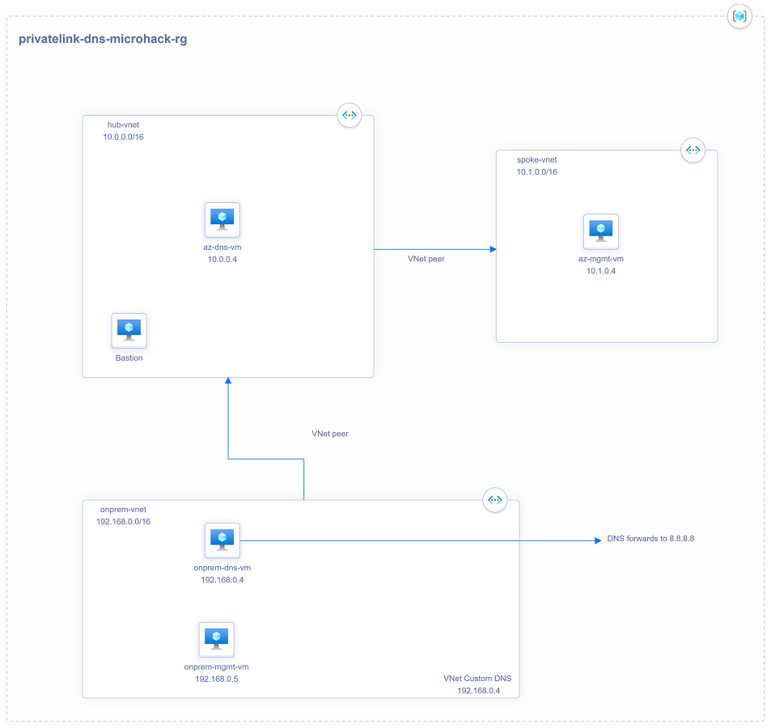

# **Azure Private Link DNS MicroHack**

# Contents

[MicroHack introduction and context](#Scenario)

[Challenge 1 : Connect to Azure SQL](#challenge-1--connect-to-azure-sql)

[Challenge 2 : Test VNet Service Enpoints](#challenge-2--test-vnet-service-endpoints)

[Challenge 3 : Connect using Private Endpoint in the spoke](#challenge-3--Connect-using-Private-Endpoint-in-the-spoke)

[Challenge 4 : Custom DNS server in Hub](#challenge-4--Custom-DNS-server-in-Hub)

[Challenge 5 : Use Private Link from On-prem](#challenge-5--Use-Private-Link-from-On-prem)

[Challenge 6 : Stretch Goal](#challenge-6--Stretch-Goal)

# Scenario

Contoso group is a consumer retail finance company. The organisation works within a regulated industry and would like to secure their use of Azure Platform-as-a-service (PaaS) products. As part of their ongoing evaluation of platform features, the IT team has started to look at using **Azure Private Link**. 

## Context

This MicroHack scenario walks through the use of Azure Private Link with a focus on the required changes needed for DNS. Specifically, this builds up to include working with an existing custom DNS infrastructure (I.e. a customer using their own Virtual Machines for Internal DNS Resolution). In this lab we use Microsoft DNS running on top of Microsoft Windows Server 2019, but your customer could be using another DNS solution such as BIND on Linux, or Infoblox. 

This lab is not a full explanation of Azure Private Link as a technology, please consider the following articles required pre-reading to build foundational knowledge.

- aka.ms/whatisprivatelink - Introductory video on Private Link
- aka.ms/whyprivatelink - High level white paper exploring the requirement for Private Link.

Optional (read this after completing this lab to take your learning even deeper!

- aka.ms/privatelinkdns - Technical white paper introducing the DNS challenge when working with Private Link

# Pre-requisites

## Overview

In order to use the MicroHack time most effectively, the following tasks should be completed prior to starting the session.

With these pre-requisites in place, we can focus on building the differentiated knowledge in Private Link that is required when working with the product, rather than spending hours repeating relatively simple tasks such as setting up Virtual Networks and Virtual Machines. 

At the end of this section your base lab build looks as follows:

In summary:

- "On-Premises" environment simulated by Azure Virtual Network
- On-Premises contains a management VM (*onprem-mgmt-vm*) and a dns server VM (*onprem-dns-vm*)
- On-Premises is connected to Azure via VNet peering to make the lab faster
- Azure contains a simple Hub and Spoke topology, containing a management VM in the spoke (*az-mgmt-vm*) and a dns server VM in the hub (*az-dns-vm*)
- Azure Bastion is deployed in the Hub to enable easy remote desktop access to the Windows VMs
- All of the above is deployed within a single resource group called *privatelink-dns-microhack-rg*

## Task 1 : Deploy Template

We are going to use a predefined Terraform template to deploy the base environment. It will be deployed in to *your* Azure subscription, with resources running in the Azure West Europe region.

To start the terraform deployment, follow the steps listed below:

- Login to Azure cloud shell [https://shell.azure.com/](https://shell.azure.com/)
- Ensure that you are operating within the correct subscription via:

`az account show`

- Clone the following GitHub repository 

`git clone https://github.com/adstuart/azure-privatelink-dns-microhack`

- Go to the new folder azure-privatelink-dns-microhack and initialize the terraform modules and download the azurerm resource provider

`terraform init`

- Now run apply to start the deployment (When prompted, confirm with a **yes** to start the deployment)

`terraform apply`

- Choose a suitable password to be used for your Virtual Machines administrator account (username: AzureAdmin)

- Wait for the deployment to complete. This will take around 5 minutes

## Task 2 : Explore and verify the deployed resources

- Verify you can access all four Virtual Machine via Azure Bastion

Username: AzureAdmin

Password: {as per above step}

- Verify that your VNet Peerings are funcitoning as expected. The easiest way to do this is to use Bastion to connect to all 4 VMs. Leave each one open in a new tab as you'll use them later. 
Remember not to rely on ping as this may be blocked

## Task 3 : Install SQL Server Management Studio on both az-mgmt-vm and onprem-mgmt-vm

- As part of this MicroHack you will require SQL Server Management Studio to beinstalled on both of the above VMs. Please install this prior to the lab from thw following link https://docs.microsoft.com/en-us/sql/ssms/download-sql-server-management-studio-ssms?view=sql-server-ver15. You may find setting "IE Enhanced Security Configuration" to off (within Server Manager) makes the task easier to perform via Internet Explorer.

## :checkered_flag: Results

- You have deployed a basic Azure and On-Premises environment using a Terraform template
- You have become familiar with the components you have deployed in your subscription
- You are now be able to login to all VMs using your specified credentials
- End-to-end network connectivity has been verified from On-Premises to Azure
- You have installed the required software

Now that we have the base lab deployed, we can progress to the Private Link challenges!

# Challenge 1 : Connect to Azure SQL

Deploy a simple Azure SQL Server (logical server) into the lab Resource Group and observe the default network behaviour when connecting to it. 
We only need **server** (free) not **database** to be able to test connectivity.
Test connectivity using SSMS and the dynamic public IP (SNAT) of your 'az' and 'onprem' mgmt vms.

### :point_right: Hint 
1. curl ifconfig.co
2. "Allow Azure services and resources to access this server" = **No**

# Challenge 2 : Test VNet Service Endpoints

VNet Service Endpoints are the 'old' way to provide restricted connectivity but can still be useful in some scenarios.
Test this before starting on Private Link.
Ensure you block public connectivity and remove the SQL firewall allow rule to make sure you're using VNet Service Endpoints.

## :checkered_flag: Results

- Your SQL Server is no longer accepting connections from any Public IP address. It only accepts connections from your a specific subnet where service endpoints are enabled. 
- Using the nslookup command, from your *az-mgmt-vm* check the DNS response being returned for your SQL Server FQDN. Notice how the DNS lookup returns a Public IP.

## 2.1: Remove Service Endpoints

Make sure to remove the VNet Service Endpoint and test you can no longer access the SQL server from the mgmt VM.

# Challenge 3 : Connect using Private Endpoint in the spoke

Create a Private Endpoint for your SQL Server in the spoke VNet.

Deny public network access.

Test with nslookup in spoke

### :point_right: Hint 

**Notice how the DNS lookup now returns a Private IP address, and not a Public IP.**

Test with SSMS

 
# Challenge 4 : Custom DNS server in Hub

Usually Azure VNets will be using custom DNS servers to provide consistent name resolution across VNets and integration with on-prem DNS.

For this challenge you need to:

1) Allow the Hub server to connect to the private endpoint in the spoke
2) Configure the spoke VNet to use the custom DNS server in the Hub

### :point_right: Hint 

- Make sure your hub vm can 'see' the private DNS zone containing the private endpoint records

- Make sure the Hub DNS server knows where to forward to in order to resolve Azure private DNS records

- Clear the DNS cache on your *az-mgmt-vm* VM via 'ipconfig /flushdns'. 
- Clear the DNS cache on your *az-dns-vm* VM. (Browse DNS Manager, right-click server name 'clear cache')
- Re-run nslookup on the *az-mgmt-vm* VM in Azure to ensure the Private IP is once again being returned
- Connect via SSMS, proving that Private Link is once again operational

## :checkered_flag: Results

- You are now using Azure Private Link to access your SQL server alongside the use of a custom DNS server inside of Azure. DNS requests from your *az-mgmt-vm* VM within the Spoke VNet are being sent via the Microsoft Windows Server inside of your Hub VNet (*az-dns-vm* VM). This server is configured to send all unknown requests to Azure DNS.

# Challenge 5 : Use Private Link from On-prem

Customers have existing on-prem DNS infrastructure which is critical for normal operations. It is hard to get them to make changes to this so we must be able to clearly articulate the benefits of doing so and exactly why it is required.

For this challenge you need to:

1) Configure a Conditional Forwarder in the on-prem DNS to use your Azure custom DNS server to resolve **database.windows.net
2) Test resolution using nslookup from onprem-mgmt-vm
3) Connect using SSMS

### :point_right: Hint 

- Conditional forwarder

## :checkered_flag: Results

- You are now using Azure Private Link to access your SQL server from On-Premises. You have modified your DNS configuration to make this work, as depicted in the packet-walk diagram below.

 
# Challenge 6 : Stretch Goal

**(Warning! Stretch Goal / Advanced) Use Private Link from On-Premises without a pre-existing DNS Server in Azure

### Goal

What would happen if you were given Challenge 6 but did not have an existing DNS Server inside of Azure (I.e. *az-dms-vm* VM did not exist)? How would you proxy DNS requests to the 168 address? In this challenge we will introduce two solutions to this problem. This is for customers that do not have existing IaaS DNS servers inside of Azure to perform this DNS request proxy function.

### :point_right: Hint 

**These advanced tasks are left open ended on purpose, without solutions, to solicit group discussion.**

## Option 1 :  Utilise advanced features of Azure Firewall to proxy DNS requests

Perhaps you do not have DNS Servers inside of Azure, but you **do** have an Azure Firewall deployed. Have a look at one of the new features of Azure Firewall and consider how this could be used in place of our Hub VNet DNS Server.

https://docs.microsoft.com/en-us/azure/firewall/dns-settings
 
Further reading - https://github.com/adstuart/azure-privatelink-dns-azurefirewall

## Option 2 :  Deploy a light-weight highly-available DNS proxy based on NGINX

https://github.com/microsoft/PL-DNS-Proxy
 
# Finished? Save money

You can shut down or delete resources to save money.

1) Shut down all VMs
2) Delete Bastion (it can't be shut down currently and is the most expensive resource). It's easy to deploy when you need it
3) Optionally delete the resource group privatelink-dns-microhack-rg

Thank you for participating in this MicroHack!

